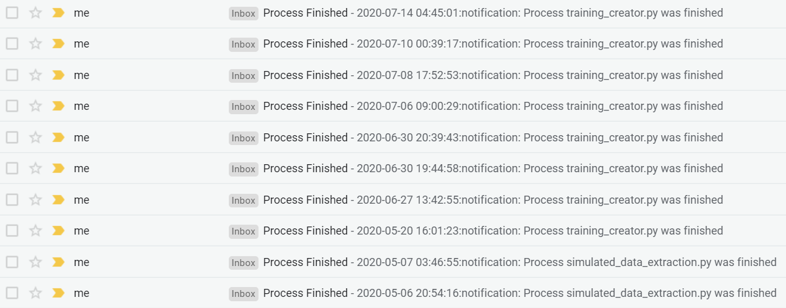

# Email Notifications
This is a simple tool that uses Google API to send notification emails.
I mainly append it at the end of my programs to send me an email when it is finished so that I do not have to check on it every time.

## Usage
This tool uses [Yagmail](https://github.com/kootenpv/yagmail) where you can learn to set your Google API up from their [readme](https://github.com/kootenpv/yagmail/blob/master/README.md). I have included the oauth2.py file in this repo also which would be used to set up the API so you do not need to copy and paste the code that generates the refresh token from [this link](https://blog.macuyiko.com/post/2016/how-to-send-html-mails-with-oauth2-and-gmail-in-python.html).

You will then need to set you email_notification.py with the receiver email address and the credentials file location.

After that, it is as simple as the two liner test_notif.py.

I have been using this tool for a while and it has been making my life much easier as you can see from the sample of emails below.

